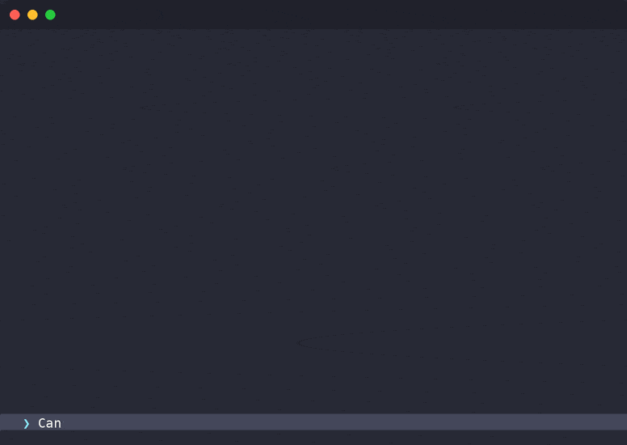
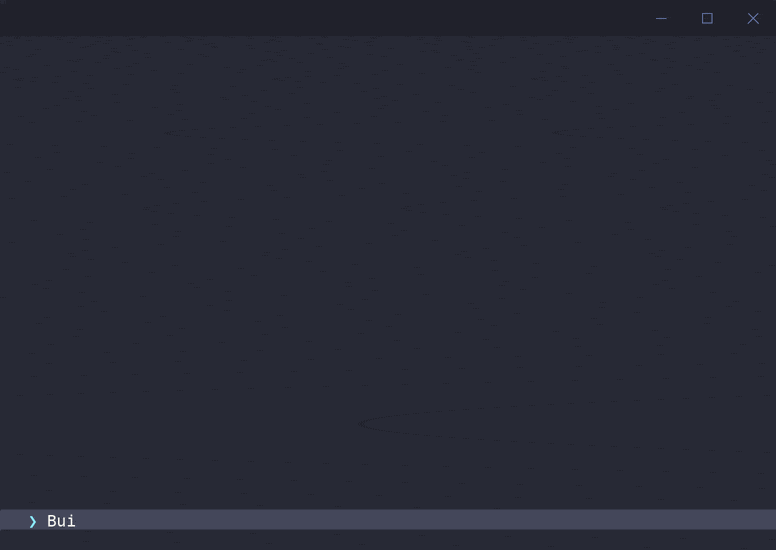

# agent-log-gif

[](https://pypi.org/project/agent-log-gif/)
[](https://github.com/ysamlan/agent-log-gif/actions?query=workflow%3ATest)
[](https://github.com/ysamlan/agent-log-gif/blob/main/LICENSE)

Turn your Claude Code and Codex sessions into animated terminal replays. Share them on Reddit, Slack, or wherever.



<details>
<summary>Windows chrome + Codex session</summary>



</details>

## Quick start

```bash
uvx agent-log-gif json session.jsonl -o demo.gif
```

Or pick from your recent local sessions interactively:

```bash
agent-log-gif
```

To install permanently:

```bash
uv tool install agent-log-gif
```

## Optional tools

GIF output works out of the box. For better compression and video output, install these:

| Tool | What it does | Recommended? |
|------|-------------|--------------|
| [gifsicle](https://www.lcdf.org/gifsicle/) | Compresses GIFs 80-85% smaller | Yes |
| [ffmpeg](https://ffmpeg.org/) | Enables MP4 and AVIF output, music tracks | For video |

<details>
<summary>Installation instructions</summary>

**macOS:**
```bash
brew install gifsicle ffmpeg
```

**Ubuntu/Debian:**
```bash
sudo apt install gifsicle ffmpeg
```

**Windows:**
```bash
choco install gifsicle ffmpeg
```

**Or download directly:**
- gifsicle: https://www.lcdf.org/gifsicle/
- ffmpeg: https://ffmpeg.org/download.html

</details>

## Usage

### Convert a session file

```bash
# GIF (default)
agent-log-gif json session.jsonl -o demo.gif

# MP4 (smaller files, requires ffmpeg)
agent-log-gif json session.jsonl -o demo.mp4 --format mp4

# Animated AVIF (requires ffmpeg)
agent-log-gif json session.jsonl -o demo.avif --format avif
```

### Pick from local sessions

```bash
agent-log-gif                  # interactive picker, opens result
agent-log-gif local --limit 20 # show more sessions
agent-log-gif local -o out.gif # save to specific file
```

### Turn selection

Sessions default to 20 turns max. Adjust with `--turns`:

```bash
agent-log-gif json session.jsonl --turns 5      # first 5 turns
agent-log-gif json session.jsonl --turns 3,8    # turns 3 through 8
```

### Music (MP4 only)

```bash
agent-log-gif json session.jsonl -o demo.mp4 --format mp4 --music track.mp3
agent-log-gif json session.jsonl -o demo.mp4 --format mp4 --music track.mp3 --loop-music
```

### Window chrome

Default is macOS-style with rounded corners and traffic-light buttons. Choose a different style:

```bash
agent-log-gif json session.jsonl --chrome none         # no window frame
agent-log-gif json session.jsonl --chrome mac          # macOS (default)
agent-log-gif json session.jsonl --chrome mac-square   # macOS, square corners
agent-log-gif json session.jsonl --chrome windows      # Windows 11
agent-log-gif json session.jsonl --chrome linux        # GNOME/Ubuntu
```

### Color scheme

480+ terminal color schemes bundled from [iTerm2-Color-Schemes](https://github.com/mbadolato/iTerm2-Color-Schemes). Default is Dracula.

```bash
agent-log-gif json session.jsonl --color-scheme "Catppuccin Mocha"
```

### Custom font

Default is [DejaVu Sans Mono](https://dejavu-fonts.github.io/) (bundled). Override with any TTF:

```bash
agent-log-gif json session.jsonl --font /path/to/MyFont.ttf
```

### Supported session formats

- Claude Code JSONL files (`~/.claude/projects/`)
- Claude Code JSON session files
- Codex JSONL session files (`~/.codex/sessions/`)
- URLs to any of the above

### Web sessions

> [!WARNING]
> The `web` command relies on unofficial, undocumented APIs and may not work reliably.

```bash
agent-log-gif web                       # interactive session picker
agent-log-gif web SESSION_ID            # specific session
agent-log-gif web --repo owner/repo     # filter by repo
```

On macOS, credentials are auto-detected from your keychain. On other platforms, provide `--token` and `--org-uuid`.

## All options

```
agent-log-gif json [OPTIONS] FILE

  -o, --output PATH        Output file path (default: <input>.<format>)
  --format [gif|mp4|avif]  Output format (default: gif)
  --turns TEXT             N for first N turns, M,N for range
  --music PATH             Music track for MP4
  --loop-music             Loop music if shorter than video
  --chrome STYLE           Window chrome: none|mac|mac-square|windows|linux
  --color-scheme NAME      Terminal color scheme (e.g. Dracula, Nord)
  --font PATH              Custom TTF font file
  --open / --no-open       Open result in default viewer
```

## Credits

Session parsing logic originally based on [Simon Willison](https://simonwillison.net/)'s [claude-code-transcripts](https://github.com/simonw/claude-code-transcripts).
Color schemes from [iTerm2-Color-Schemes](https://github.com/mbadolato/iTerm2-Color-Schemes) by Mark Badolato (MIT license).

## Development

See [CONTRIBUTING.md](CONTRIBUTING.md) for setup and guidelines.

Quick start:

```bash
uv sync && just test
```
